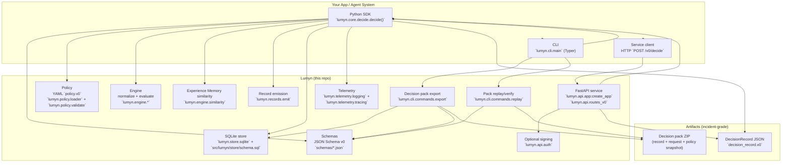
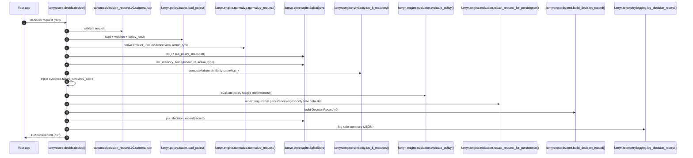
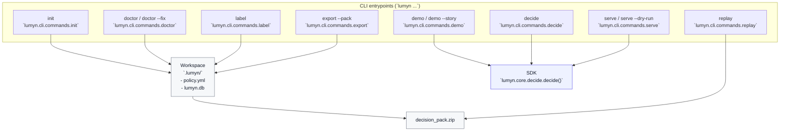
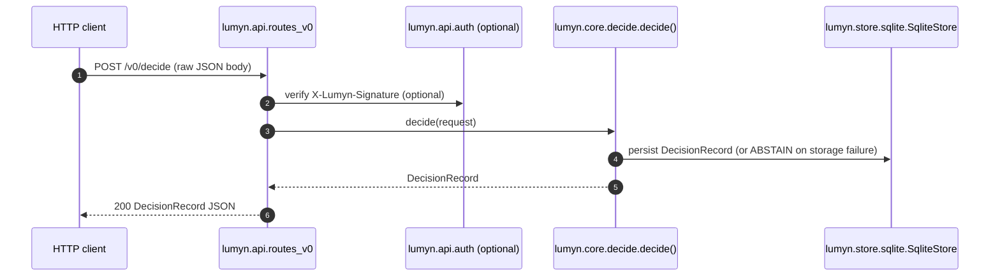
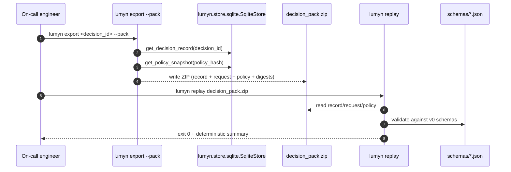

# Architecture

This document describes Lumyn’s current (v0) architecture as implemented in this repo: a Python SDK, a PLG-grade CLI, and an optional FastAPI service that all produce the same `DecisionRecord` contract.

## High-level component architecture

## SDK flow: `decide()` end-to-end

The SDK is the source-of-truth flow; both the CLI and the service call into it.

### Failure semantics: storage unavailable

If SQLite persistence is unavailable, Lumyn returns a schema-valid `DecisionRecord` with:
- `verdict=ABSTAIN`
- `reason_codes` includes `STORAGE_UNAVAILABLE`

This applies to SDK and service mode (service should return 200 with an ABSTAIN record, not 500).

## CLI flows (PLG paths)

## Service flow: FastAPI `POST /v0/decide`

The service is a thin HTTP wrapper around the SDK.

## Incident flow: decision pack export and replay verify

Decision packs are designed to be copied into incident tickets and validated offline.

## Key “source of truth” files

- SDK core: `src/lumyn/core/decide.py`
- Policy: `src/lumyn/policy/loader.py`, `src/lumyn/policy/validate.py`, `policies/*.yml`
- Engine: `src/lumyn/engine/evaluator.py`, `src/lumyn/engine/normalize.py`, `src/lumyn/engine/similarity.py`
- Records: `src/lumyn/records/emit.py`, `schemas/decision_record.v0.schema.json`
- Store: `src/lumyn/store/sqlite.py`, `src/lumyn/store/schema.sql`
- Service: `src/lumyn/api/app.py`, `src/lumyn/api/routes_v0.py`, `src/lumyn/api/auth.py`
- CLI: `src/lumyn/cli/main.py`, `src/lumyn/cli/commands/*`
